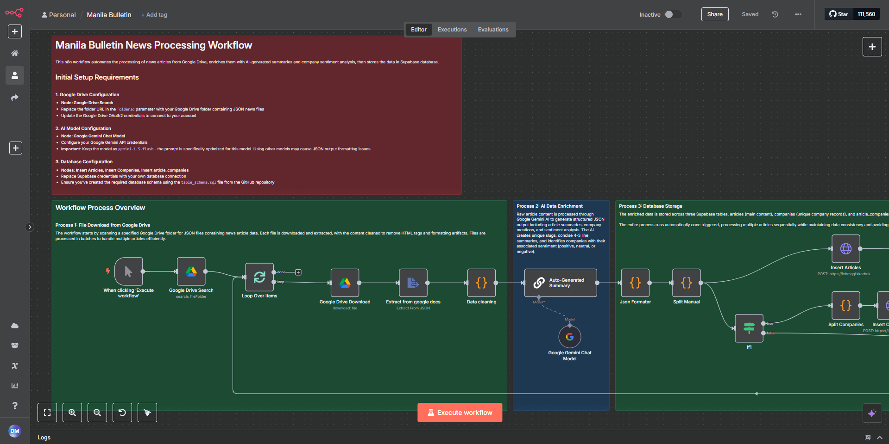
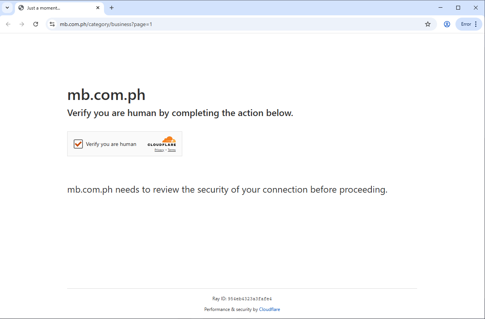

# 🕷️ News Article Scraper with AI-Powered Summary, Sentiment & Entity Extraction and Database Integration

This project automates the extraction and analysis of 500 recent business news articles from [MB.com.ph](https://mb.com.ph), a publicly accessible news website that offers business content without login requirements. The scraper is designed to comply with the site's public access policy and terms of service.

The system is designed to convert raw news content into enriched, structured records by applying AI-powered summary generation, company entity recognition, and per-company sentiment analysis. The final output is stored in a relational database for downstream analysis and applications.

The pipeline begins with a custom-built **SeleniumBase** scraper, which navigates through paginated listings on MB.com.ph, handles Cloudflare Turnstile protection, and runs in **non-headless mode on Windows** to ensure stealth browsing. Each article is processed to extract the **title**, **full content**, and **images** (captured via screenshots), then saved as a structured `.json` file into a designated **Google Drive** folder.

In the next phase, an **n8n automation workflow** handles post-processing:

- Retrieves each JSON article file from Google Drive  
- Cleans and normalizes the article text  
- Sends the content to **Google Gemini 1.5 Flash** for AI enrichment, including:  
  - Auto-generating a concise summary (4–5 lines)  
  - Extracting mentioned company names  
  - Assigning sentiment labels (positive, neutral, or negative) to each company mention  
- Writes the enriched result into a **Supabase SQL database**, structured across three interrelated tables:  
  - `articles` (article text, summary, metadata)  
  - `companies` (distinct entities)  
  - `article_companies` (join table with sentiment annotations)

This fully automated pipeline ensures fast, scalable, and structured business news processing, ready to be used for dashboards, search tools, or decision intelligence systems.

<p align="center">
  
  
</p>

## 🧰 Technology Stack

| No. | Technology             | Description |
|-----|------------------------|-------------|
| 1   | **Python**             | The main programming language used for scripting the scraper and handling data. |
| 2   | **JavaScript**         | Used inside n8n Code nodes for custom logic, data transformation, and JSON manipulation. |
| 3   | [**SeleniumBase**](https://seleniumbase.io/help_docs/uc_mode/)| Enables automated scraping in undetected Chrome (UC) mode to bypass Cloudflare Turnstile protection. |
| 4   | **Google Drive**       | Temporary storage for raw `.json` article data consumed later by n8n. |
| 5   | **n8n**                | Handles AI enrichment, data cleaning, and inserts structured data into the database. |
| 6   | **Gemini 1.5 Flash**   | AI model used to generate summaries, extract company names, and perform sentiment analysis. |
| 7   | **Supabase**           | A Postgres-based cloud database for storing structured article, company, and sentiment data. |
| 8   | **Slugify**            | Generates clean and unique slugs for article IDs used in database entries. |
| 9   | **Markdown/JSON Validators** | Ensure proper formatting and consistency of AI-generated outputs before insertion. |
| 10  | **Windows OS**         | Required to run the SeleniumBase scraper in non-headless mode for optimal stealth and browser compatibility. |

## ⚙️ Installation & Usage

### 1. Install Requirements (Windows)

- ✅ Install the latest **Python for Windows**: [https://www.python.org/downloads/](https://www.python.org/downloads/)
- ✅ Install **Google Chrome** (required to match with ChromeDriver)

> Make sure Python and Chrome are added to your system's PATH.

---

### 2. Configure the Scraper

Open the `mbscraper.py` file and edit the following section to set the number of articles to scrape and the output directory:

```python
# Configuration
max_articles = 500
base_url = "https://mb.com.ph/category/business?page="
output_dir = r"D:\mb"  # Change this to your desired output folder
```
### 3. Run the Scraper

```bash
python mbscraper.py
```
- This will launch a Chrome browser in non-headless mode.
- The script will open the URL https://mb.com.ph/category/business?page=1.
- Do not touch your mouse or keyboard, the cursor will automatically click the Cloudflare Turnstile widget to pass bot protection.
- Once the Turnstile is passed, the script will begin scraping and saving data into the designated output directory.
- JSON article data and screenshots will be saved to the folder you specified (`output_dir`).

### 4. Run the n8n Workflow

#### Prerequisites
1. Open n8n (self-hosted or cloud).
2. Import the provided `Manila_Bulletin_N8N.json` workflow file.
3. Make sure to initialize your database using the `table_schema.sql` file before running the n8n workflow.

#### Configuration Setup

3. Set up the following environment-specific configurations:

Detailed instructions are included inside the `Manila_Bulletin_N8N.json` file after importing it into n8n.

- **Google Drive Folder Path** – Where the scraped JSON files are stored  
- **Gemini 1.5 Flash Credentials** – Required for AI-based enrichment  
- **Supabase Credentials** – Used for inserting structured data into the database from n8n  

#### Execution
Once configured, trigger the workflow and let it automatically:
* Fetch JSON articles from Drive
* Process them with Gemini
* Insert structured outputs into the Supabase tables


